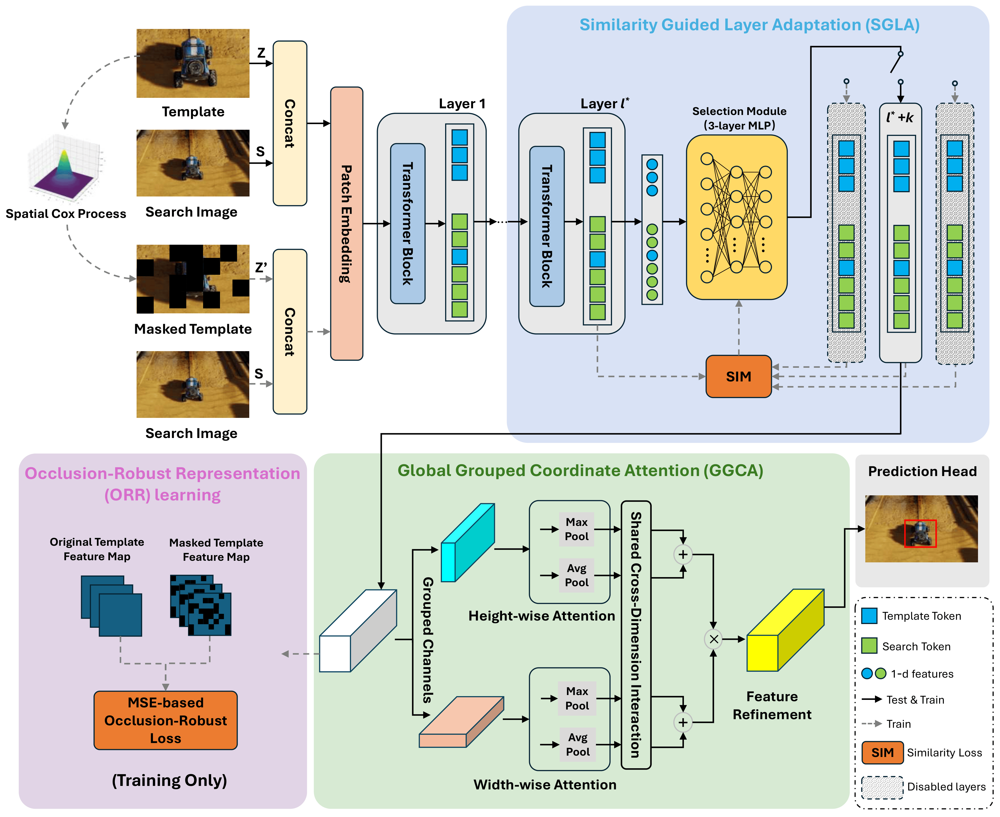

# LGTrack
The implementation for the paper [**Layer-Guided UAV Tracking: Enhancing Efficiency and Occlusion Robustness**]

<p align="center">
  
</p>

## Usage
### Installation
Create and activate a conda environment:
```
conda create -n LGTrack python=3.8
conda activate LGTrack
```

Install the required packages:
```
pip install -r requirements.txt
```

## Data Preparation
Put the tracking datasets in ./data. It should look like:
   ```
   ${PROJECT_ROOT}
    -- data
        -- lasot
            |-- airplane
            |-- basketball
            |-- bear
            ...
        -- got10k
            |-- test
            |-- train
            |-- val
        -- coco
            |-- annotations
            |-- images
        -- trackingnet
            |-- TRAIN_0
            |-- TRAIN_1
            ...
            |-- TRAIN_11
            |-- TEST         
   ```

### Path Setting
Run the following command to set paths:
```
cd <PATH_of_LGTrack>
python tracking/create_default_local_file.py --workspace_dir . --data_dir ./data --save_dir ./output
```
You can also modify paths by these two files:
```
./lib/train/admin/local.py  # paths for training
./lib/test/evaluation/local.py  # paths for testing
```

### Training
```
python tracking/train.py --script lgtrack --config deit_tiny_patch16_224  --save_dir ./output --mode single
```

### Testing
Put the downloaded weights on `<PATH_of_LGTrack>/output/checkpoints/train/lgtrack/deit_tiny_patch16_224`
```
python tracking/test.py lgtrack deit_tiny_patch16_224 --dataset uav123 --threads 4 --num_gpus 1
python tracking/analysis_results.py # need to modify tracker configs and names
```

### Test FLOPs, and Params.

```
python tracking/profile_model.py --script lgtrack --config deit_tiny_patch16_224
```

## Citation
If our work is useful for your research, please consider citing.
